# Laporan Resmi Praktikum Modul 2
### Komunikasi Data & Jaringan Komputer 2026

**Kelompok:** K-02  
**Prefix IP Kelompok:** `192.212.x.x`  
**Tema:** *Shadow Net Operation*  

>Naila Anggun Eka Rizqy | 5027251122

>Maulana Zaki Putra Zakaria | 5027251009

---

## Soal 1

>Dikerjakan Oleh Zaki

### Soal
> Sebagai pusat kesadaran The Mesh, rootkit harus merentangkan koneksinya ke lima gerbang utama (Switch). Tetapkan alamat IP dan default gateway untuk seluruh Entitas, mulai dari para operator (alpha, beta, gamma), penjaga directory (prab, tedd), gerbang penyaring (abbey, penny), hingga repository (obladi, desmond, oblada, molly) sesuai dengan topologi pembagian switch yang dirancang. [GUNAKAN PREFIX IP MASING-MASING KELOMPOK].

### Langkah Pengerjaan

1. **Topologi dan Pengkabelan (*Wiring*) pada GNS3**:
   - Router **`rootkit`** (Debinet) dikonfigurasi memiliki 6 network adapter:
     - `eth0` $\rightarrow$ NAT (Koneksi WAN / Internet)
     - `eth1` $\rightarrow$ **Switch1** (Subnet 1: Resolusi & Repositori)
     - `eth2` $\rightarrow$ **Switch6** (Subnet 2: Klien Sayap Kiri)
     - `eth3` $\rightarrow$ **Switch7** (Subnet 3: Klien Sayap Kanan)
     - `eth4` $\rightarrow$ **Switch4** (Subnet 4: Gerbang Abbey)
     - `eth5` $\rightarrow$ **Switch5** (Subnet 5: Gerbang Penny)
   - Kaskade Switch 1, 2, dan 3:
     - `Switch1` terhubung ke `Switch2` dan `Switch3`
     - `Switch2` terhubung ke **`prab`** (`eth0`) dan **`tedd`** (`eth0`)
     - `Switch3` terhubung ke **`obladi`**, **`desmond`**, **`oblada`**, dan **`molly`**
   - Klien Sayap Kiri & Kanan:
     - `Switch6` $\rightarrow$ **`alpha`**, **`beta`**, dan **`gamma`**
     - `Switch7` $\rightarrow$ **`delta`** dan **`epsilon`**
   - Gerbang Penyaring:
     - `Switch4` $\rightarrow$ **`abbey`**
     - `Switch5` $\rightarrow$ **`penny`**

2. **Tabel Alokasi Pengalamatan IP (Prefix `192.212.x.x`)**:

   | Subnet | Network ID | Node / Host | Interface | Alamat IP | Netmask | Default Gateway |
   | :--- | :--- | :--- | :--- | :--- | :--- | :--- |
   | **WAN** | `192.168.122.0/24` | `rootkit` | `eth0` | DHCP (`192.168.122.x`) | Sesuai DHCP | `192.168.122.1` |
   | **Subnet 1** | `192.212.1.0/24` | `rootkit`<br>`prab`<br>`tedd`<br>`obladi`<br>`desmond`<br>`oblada`<br>`molly` | `eth1`<br>`eth0`<br>`eth0`<br>`eth0`<br>`eth0`<br>`eth0`<br>`eth0` | `192.212.1.1`<br>`192.212.1.2`<br>`192.212.1.3`<br>`192.212.1.4`<br>`192.212.1.5`<br>`192.212.1.6`<br>`192.212.1.7` | `255.255.255.0`<br>`255.255.255.0`<br>`255.255.255.0`<br>`255.255.255.0`<br>`255.255.255.0`<br>`255.255.255.0`<br>`255.255.255.0` | None (Gateway)<br>`192.212.1.1`<br>`192.212.1.1`<br>`192.212.1.1`<br>`192.212.1.1`<br>`192.212.1.1`<br>`192.212.1.1` |
   | **Subnet 2** | `192.212.2.0/24` | `rootkit`<br>`alpha`<br>`beta`<br>`gamma` | `eth2`<br>`eth0`<br>`eth0`<br>`eth0` | `192.212.2.1`<br>`192.212.2.2`<br>`192.212.2.3`<br>`192.212.2.4` | `255.255.255.0`<br>`255.255.255.0`<br>`255.255.255.0`<br>`255.255.255.0` | None (Gateway)<br>`192.212.2.1`<br>`192.212.2.1`<br>`192.212.2.1` |
   | **Subnet 3** | `192.212.3.0/24` | `rootkit`<br>`delta`<br>`epsilon` | `eth3`<br>`eth0`<br>`eth0` | `192.212.3.1`<br>`192.212.3.2`<br>`192.212.3.3` | `255.255.255.0`<br>`255.255.255.0`<br>`255.255.255.0` | None (Gateway)<br>`192.212.3.1`<br>`192.212.3.1` |
   | **Subnet 4** | `192.212.4.0/24` | `rootkit`<br>`abbey` | `eth4`<br>`eth0` | `192.212.4.1`<br>`192.212.4.2` | `255.255.255.0`<br>`255.255.255.0` | None (Gateway)<br>`192.212.4.1` |
   | **Subnet 5** | `192.212.5.0/24` | `rootkit`<br>`penny` | `eth5`<br>`eth0` | `192.212.5.1`<br>`192.212.5.2` | `255.255.255.0`<br>`255.255.255.0` | None (Gateway)<br>`192.212.5.1` |

3. **Konfigurasi Interface (`/etc/network/interfaces`)**:

   - **Node `rootkit` (Router Sentral)**:
     ```bash
     auto eth0
     iface eth0 inet dhcp

     auto eth1
     iface eth1 inet static
         address 192.212.1.1
         netmask 255.255.255.0

     auto eth2
     iface eth2 inet static
         address 192.212.2.1
         netmask 255.255.255.0

     auto eth3
     iface eth3 inet static
         address 192.212.3.1
         netmask 255.255.255.0

     auto eth4
     iface eth4 inet static
         address 192.212.4.1
         netmask 255.255.255.0

     auto eth5
     iface eth5 inet static
         address 192.212.5.1
         netmask 255.255.255.0
     ```

   - **Node Subnet 1 (`prab`, `tedd`, `obladi`, `desmond`, `oblada`, `molly`)**:
     *(Contoh pada `prab`, sesuaikan IP host untuk node lainnya)*
     ```bash
     auto eth0
     iface eth0 inet static
         address 192.212.1.2
         netmask 255.255.255.0
         gateway 192.212.1.1
         up echo "nameserver 192.168.122.1" > /etc/resolv.conf
     ```

   - **Node Subnet 2 (`alpha`, `beta`, `gamma`)**:
     *(Contoh pada `alpha`)*
     ```bash
     auto eth0
     iface eth0 inet static
         address 192.212.2.2
         netmask 255.255.255.0
         gateway 192.212.2.1
         up echo "nameserver 192.168.122.1" > /etc/resolv.conf
     ```

   - **Node Subnet 3 (`delta`, `epsilon`)**:
     *(Contoh pada `delta`)*
     ```bash
     auto eth0
     iface eth0 inet static
         address 192.212.3.2
         netmask 255.255.255.0
         gateway 192.212.3.1
         up echo "nameserver 192.168.122.1" > /etc/resolv.conf
     ```

   - **Node Subnet 4 (`abbey`)**:
     ```bash
     auto eth0
     iface eth0 inet static
         address 192.212.4.2
         netmask 255.255.255.0
         gateway 192.212.4.1
         up echo "nameserver 192.168.122.1" > /etc/resolv.conf
     ```

   - **Node Subnet 5 (`penny`)**:
     ```bash
     auto eth0
     iface eth0 inet static
         address 192.212.5.2
         netmask 255.255.255.0
         gateway 192.212.5.1
         up echo "nameserver 192.168.122.1" > /etc/resolv.conf
     ```

4. **Skrip Otomasi Persistensi (`/root/init.sh`)**:
   Setiap node dilengkapi dengan skrip `/root/init.sh` untuk memastikan konfigurasi alamat IP, default gateway, dan resolver awal diterapkan secara instan dan dapat dijalankan otomatis.

### Bukti dan Hasil

1. **Topologi Jaringan di GNS3**:
   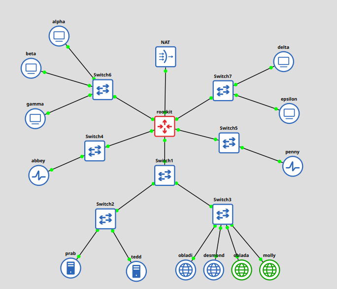
   *Topologi lengkap "The Mesh" berhasil dirancang pada GNS3 dengan penataan ikon affinity yang spesifik (router merah, switch kotak biru, klien PC lingkaran biru, gerbang penyaring pulse/health, server direktori, vault web statis bola dunia biru, dan core web dinamis bola dunia hijau).*

2. **Verifikasi Alamat IP & Tabel Routing Router `rootkit` (`ip -br addr; route -n`)**:
   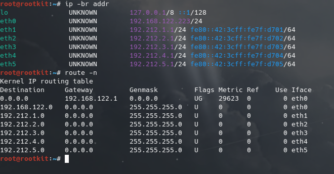
   *Hasil eksekusi pada router rootkit menunjukkan seluruh antarmuka (eth0 hingga eth5) telah aktif dan terpasang alamat IP yang tepat, serta tabel routing kernel mengenali langsung kelima subnet LAN.*

3. **Uji Konektivitas Klien ke Default Gateway Masing-Masing**:
   - **Klien `alpha` $\rightarrow$ Gateway Subnet 2 (`192.212.2.1`)**:
     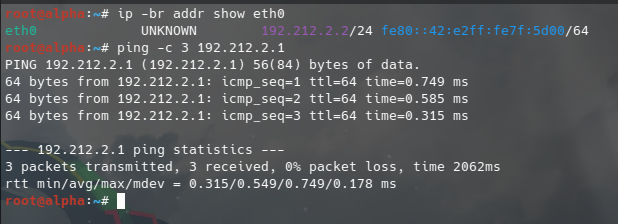
     *Node `alpha` pada Subnet 2 (`192.212.2.2`) berhasil melakukan ping ke default gateway `192.212.2.1` di router `rootkit` dengan 0% packet loss.*

   - **Node `prab` $\rightarrow$ Gateway Subnet 1 (`192.212.1.1`)**:
     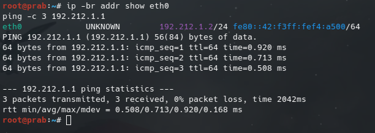
     *Node `prab` pada Subnet 1 (`192.212.1.2`) berhasil melakukan ping ke default gateway `192.212.1.1` di router `rootkit` dengan 0% packet loss.*

---

## Soal 2

>Dikerjakan Oleh Zaki

### Soal
> Meskipun The Mesh beroperasi dalam bayang-bayang, Rootkit menyadari bahwa Entitas di dalamnya masih membutuhkan asupan paket dari dunia luar. Buka jalur menuju NAT dengan memastikan antarmuka WAN di router rootkit aktif. Konfigurasikan NAT agar dapat meneruskan lalu lintas keluar bagi seluruh alamat internal, sehingga semua host di dalam jaringan dapat menjangkau internet publik menggunakan IP address.

### Langkah Pengerjaan

1. **Memastikan Antarmuka WAN (`eth0`) Aktif via DHCP di Router `rootkit`**:
   Interface WAN `eth0` pada router `rootkit` terhubung langsung ke node NAT GNS3 untuk memperoleh konfigurasi IP dinamis dan default gateway menuju jaringan luar (`192.168.122.1`).

2. **Mengaktifkan IPv4 Packet Forwarding pada Kernel Linux**:
   Agar router `rootkit` dapat meneruskan paket antar-antarmuka (dari antarmuka LAN internal `eth1` s.d. `eth5` menuju WAN `eth0`), fitur *IP forwarding* diaktifkan:
   ```bash
   sysctl -w net.ipv4.ip_forward=1
   ```

3. **Menerapkan Aturan NAT Masquerade pada `iptables`**:
   Menambahkan aturan pada tabel `nat`, chain `POSTROUTING`, dengan interface keluar (`-o`) diarahkan ke `eth0` menggunakan target `MASQUERADE`:
   ```bash
   iptables -t nat -A POSTROUTING -o eth0 -j MASQUERADE
   ```
   Aturan ini berfungsi mentranslasikan (*Network Address Translation*) seluruh alamat IP sumber dari segmen privat internal (`192.212.x.x`) menjadi alamat IP publik milik interface `eth0` router saat paket keluar menuju jaringan internet.

4. **Konfigurasi Persistensi pada `/etc/network/interfaces` di `rootkit`**:
   Agar aturan *packet forwarding* dan *NAT masquerade* tetap aktif secara otomatis pasca-reboot, perintah ditambahkan ke blok konfigurasi `eth0`:
   ```bash
   auto eth0
   iface eth0 inet dhcp
       up sysctl -w net.ipv4.ip_forward=1
       up iptables -t nat -A POSTROUTING -o eth0 -j MASQUERADE
   ```

### Bukti dan Hasil

1. **Verifikasi Tabel NAT Masquerade di Router `rootkit` (`iptables -t nat -L -n -v`)**:
   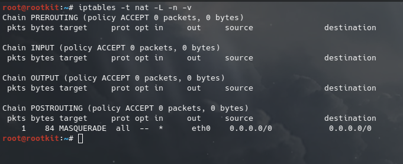
   *Tabel NAT chain POSTROUTING menunjukkan target MASQUERADE aktif pada interface eth0 untuk seluruh lalu lintas keluar dari jaringan internal (0.0.0.0/0).*

2. **Uji Konektivitas Internet Publik via IP Address dari Klien (`alpha`)**:
   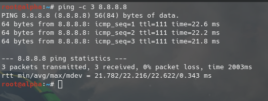
   *Pengujian ping dari host internal `alpha` (`192.212.2.2`) menuju IP publik internet `8.8.8.8` berhasil dengan 0% packet loss, membuktikan bahwa seluruh entitas The Mesh telah terhubung ke jaringan internet publik melalui NAT Masquerade.*

---

## Soal 3

>Dikerjakan Oleh Zaki

### Soal
> Jaringan rahasia tidak akan berfungsi tanpa sinkronisasi antar divisi. Pastikan seluruh Entitas dapat saling terhubung dan berkomunikasi lintas jalur (routing internal via rootkit berfungsi). Untuk menghindari fragmentasi saat persiapan, pastikan setiap host non-router menambahkan resolver 192.168.122.1 (tambah di file /etc/resolv.conf, kalau sudah pakai resolver itu tidak perlu memasukkan resolver google) saat antarmukanya aktif agar akses untuk mengunduh paket instalasi dari internet tersedia sejak awal beroperasi.

### Langkah Pengerjaan

1. **Routing Lintas Jalur Antar-Subnet (Internal Routing via `rootkit`)**:
   Karena seluruh host pada kelima subnet LAN internal telah mengatur *default gateway* mereka mengarah ke IP antarmuka router `rootkit` yang bersesuaian, dan router `rootkit` telah mengaktifkan fitur *IP Forwarding* (`net.ipv4.ip_forward=1`), maka paket data dari satu subnet (misal Subnet 2 `alpha`) dapat diteruskan secara langsung melintasi router menuju subnet lainnya (misal Subnet 3 `delta`, Subnet 1 `prab`, Subnet 4 `abbey`, atau Subnet 5 `penny`).

2. **Konfigurasi Resolver Awal (`192.168.122.1`) pada Seluruh Host Non-Router**:
   Setiap node non-router membutuhkan nameserver yang mengarah ke gateway NAT (`192.168.122.1`) saat antarmukanya aktif agar dapat melakukan resolusi nama domain publik (DNS) untuk kebutuhan unduh dan instalasi paket aplikasi di awal.
   Konfigurasi ini disematkan pada direktif `up` di file `/etc/network/interfaces` setiap node:
   ```bash
   up echo "nameserver 192.168.122.1" > /etc/resolv.conf
   ```
   Serta dieksekusi langsung pada file `/etc/resolv.conf`:
   ```bash
   echo "nameserver 192.168.122.1" > /etc/resolv.conf
   ```

### Bukti dan Hasil

1. **Uji Komunikasi Lintas Jalur Antar-Divisi (*Cross-Subnet Ping*) dari `alpha`**:
   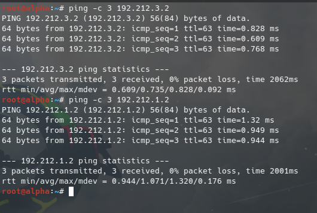
   *Pengujian ping dari host klien `alpha` (`192.212.2.2`) menuju host `delta` di Subnet 3 (`192.212.3.2`) dan DNS server `prab` di Subnet 1 (`192.212.1.2`) berhasil dengan 0% packet loss dan TTL bernilai 63 (menunjukkan paket melintasi 1 hop router rootkit).*

2. **Verifikasi File Resolver Awal & Uji Koneksi Domain Internet Publik (`alpha`)**:
   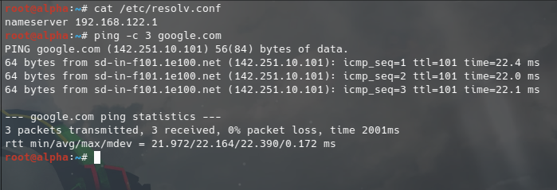
   *Pemeriksaan `/etc/resolv.conf` pada node klien membuktikan nameserver terisi `192.168.122.1`. Uji resolusi domain dan koneksi internet publik menggunakan perintah `ping -c 3 google.com` sukses dengan 0% packet loss, membuktikan host non-router siap mengunduh paket instalasi.*

---

## Soal 4

>Dikerjakan Oleh Zaki

### Soal
> Penjaga Direktori mulai menuliskan hukum The Mesh. Pada node prab, bangun zona <xxxx>.com sebagai authoritative dengan SOA yang menunjuk ke prab.<xxxx>.com, serta tambahkan catatan NS untuk prab.<xxxx>.com dan tedd.<xxxx>.com. Buat A record untuk prab.<xxxx>.com dan tedd.<xxxx>.com yang mengarah ke alamat IP mereka masing-masing, serta A record apex <xxxx>.com yang mengarah ke gerbang aplikasi dinamis (penny). Aktifkan fitur notify dan allow-transfer ke tedd, lalu set forwarders ke 192.168.122.1. Di node tedd, tarik zona <xxxx>.com dari master dan pastikan server menjawab secara authoritative. Setelah fondasi nama ini berdiri kokoh, perbarui urutan resolver pada seluruh Entitas non-router menjadi: IP prab, IP tedd, lalu 192.168.122.1. Verifikasi bahwa query ke domain apex maupun hostname di dalam zona dijawab dengan benar oleh prab atau tedd.

### Langkah Pengerjaan

1. **Konfigurasi Master DNS Server pada Node `prab` (`192.212.1.2`)**:
   - Menginstal paket BIND9: `bind9`, `bind9utils`, `bind9-doc`, `dnsutils`.
   - Mengonfigurasi `/etc/bind/named.conf.options`:
     Menambahkan `forwarders { 192.168.122.1; };` agar query domain publik internet diteruskan ke gateway NAT, serta mengaktifkan `allow-query { any; };`.
   - Mengonfigurasi `/etc/bind/named.conf.local`:
     Mendefinisikan zona `k02.com` dengan tipe `master`, direktori file `/etc/bind/k02/db.k02.com`, mengaktifkan notifikasi otomatis ke slave (`notify yes; also-notify { 192.212.1.3; };`), serta mengizinkan transfer zona hanya ke slave `tedd` (`allow-transfer { 192.212.1.3; };`).
   - Membuat file basis data zona `/etc/bind/k02/db.k02.com`:
     - SOA record menunjuk ke `prab.k02.com.` dengan penanggung jawab `root.k02.com.`.
     - NS record untuk `prab.k02.com.` dan `tedd.k02.com.`.
     - A record untuk `prab.k02.com.` (`192.212.1.2`) dan `tedd.k02.com.` (`192.212.1.3`).
     - A record apex `k02.com.` mengarah ke IP gerbang aplikasi dinamis `penny` (`192.212.5.2`).
   - Seluruh instruksi ini diabadikan dalam berkas skrip `/root/setup_prab.sh`.

2. **Konfigurasi Slave DNS Server pada Node `tedd` (`192.212.1.3`)**:
   - Menginstal paket BIND9 pada node `tedd`.
   - Mengonfigurasi `/etc/bind/named.conf.options` dengan forwarders `192.168.122.1;`.
   - Mengonfigurasi `/etc/bind/named.conf.local`:
     Mendefinisikan zona `k02.com` dengan tipe `slave`, file cache `/var/cache/bind/db.k02.com`, dan master mengarah ke `192.212.1.2;`.
   - Menjalankan service `named` sehingga `tedd` secara otomatis mereplikasi zona dari master `prab` via zone transfer.
   - Seluruh instruksi ini diabadikan dalam berkas skrip `/root/setup_tedd.sh`.

3. **Pembaruan Urutan Resolver pada Seluruh Entitas Non-Router**:
   - Sesuai instruksi soal, urutan resolver di file `/etc/resolv.conf` pada seluruh entitas non-router diperbarui menjadi:
     ```
     nameserver 192.212.1.2
     nameserver 192.212.1.3
     nameserver 192.168.122.1
     ```
   - Agar perubahan bertahan permanen saat reboot, perintah pembuatan resolver disematkan pada direktif `up` di `/etc/network/interfaces` setiap node.
   - Skrip pembaruan resolver diabadikan dalam berkas `/root/update_resolvers.sh`.

### Bukti dan Hasil

1. **Verifikasi Authoritative Master DNS pada Node `prab` (`dig @192.212.1.2 k02.com`)**:
   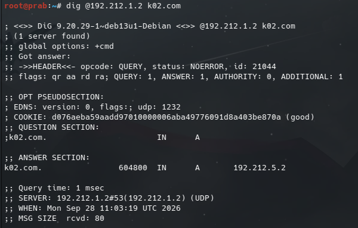
   *Pengujian query DNS langsung ke master server prab membuktikan respon authoritative (`flags: qr aa rd`) dengan jawaban A record apex k02.com mengarah ke IP penny (`192.212.5.2`).*

2. **Verifikasi Authoritative Slave DNS & Zone Transfer pada Node `tedd` (`dig @192.212.1.3 k02.com`)**:
   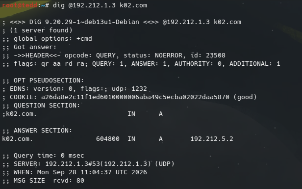
   *Query DNS ke server slave tedd membuktikan replikasi zona dari prab sukses dan server merespon secara authoritative (`flags: qr aa rd`) mengembalikan IP 192.212.5.2.*

3. **Verifikasi Urutan Resolver & Resolusi Nama dari Klien (`alpha`)**:
   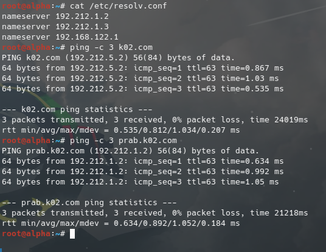
   *Pemeriksaan `/etc/resolv.conf` pada klien alpha membuktikan urutan resolver telah berubah (prab -> tedd -> NAT). Pengujian ping ke domain apex `k02.com` otomatis ter-resolve ke `192.212.5.2` dan berjalan sukses tanpa packet loss.*

---

## Soal 5

>Dikerjakan Oleh Zaki

### Soal
> "Entitas tanpa identitas adalah anomali," pesan Rootkit. Namai semua Entitas (hostname) sesuai glosarium: rootkit, alpha, beta, gamma, delta, epsilon, prab, tedd, abbey, penny, obladi, desmond, oblada, molly, dan verifikasi bahwa setiap host mengenali hostname tersebut secara system-wide. Buat setiap domain untuk masing-masing node sesuai dengan namanya (contoh: alpha.<xxxx>.com) dan assign IP masing-masing juga. Lakukan pengecualian untuk node yang bertanggung jawab atas prab dan tedd.

### Langkah Pengerjaan

1. **Penamaan Hostname System-Wide pada Seluruh Entitas**:
   - Seluruh 14 node dinamai sesuai glosarium: `rootkit`, `alpha`, `beta`, `gamma`, `delta`, `epsilon`, `prab`, `tedd`, `abbey`, `penny`, `obladi`, `desmond`, `oblada`, dan `molly`.
   - Hostname diterapkan secara system-wide dengan menuliskan nama host pada berkas `/etc/hostname` serta mengeksekusi perintah `hostname <nama_node>`. Konfigurasi ini dibuat permanen pada skrip `/root/init.sh` di setiap node.

2. **Penambahan A Record untuk Seluruh Subdomain Entitas pada Zona `k02.com` di `prab`**:
   - Berkas zona `/etc/bind/k02/db.k02.com` diperbarui dengan menambahkan pemetaan A record untuk setiap entitas menuju alamat IP masing-masing:
     - `rootkit.k02.com.` $\rightarrow$ `192.212.1.1`
     - `alpha.k02.com.` $\rightarrow$ `192.212.2.2`
     - `beta.k02.com.` $\rightarrow$ `192.212.2.3`
     - `gamma.k02.com.` $\rightarrow$ `192.212.2.4`
     - `delta.k02.com.` $\rightarrow$ `192.212.3.2`
     - `epsilon.k02.com.` $\rightarrow$ `192.212.3.3`
     - `abbey.k02.com.` $\rightarrow$ `192.212.4.2`
     - `penny.k02.com.` $\rightarrow$ `192.212.5.2`
     - `obladi.k02.com.` $\rightarrow$ `192.212.1.4`
     - `desmond.k02.com.` $\rightarrow$ `192.212.1.5`
     - `oblada.k02.com.` $\rightarrow$ `192.212.1.6`
     - `molly.k02.com.` $\rightarrow$ `192.212.1.7`
     *(Catatan: `prab.k02.com` dan `tedd.k02.com` telah dikonfigurasi sebelumnya pada Soal 4).*

### Bukti dan Hasil

1. **Verifikasi Hostname System-Wide pada Node**:
   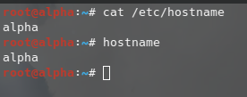
   *Pemeriksaan perintah `hostname` dan `/etc/hostname` pada node membuktikan seluruh host telah mengenali identitas nama mereka masing-masing secara system-wide.*

2. **Verifikasi Resolusi Nama Subdomain Entitas dari Klien**:
   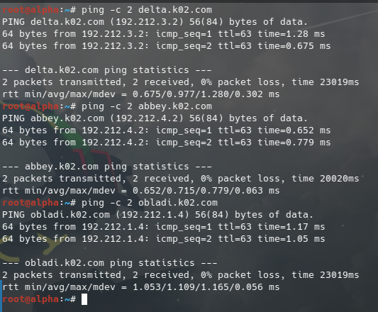
   *Pengujian ping dari klien `alpha` menuju subdomain entitas lintas kelompok (`delta.k02.com`, `abbey.k02.com`, dan `obladi.k02.com`) berhasil ter-resolve ke IP yang tepat dan berkomunikasi lancar dengan 0% packet loss.*

---

## Soal 6

>Dikerjakan Oleh Zaki

### Soal
> Pastikan zone transfer berjalan, pastikan tedd telah menerima salinan zona terbaru dari prab. Nilai serial SOA di keduanya harus sama karena keduanya tidak bisa dipisahkan dan saling melengkapi.

### Langkah Pengerjaan

1. **Penaikan Nilai Serial SOA pada Master `prab`**:
   - Setiap kali terjadi penambahan atau perubahan record pada berkas zona `/etc/bind/k02/db.k02.com`, nomor serial pada record SOA master dinaikkan (misalnya dari `2026092801` menjadi `2026092802` / `2026092803`).

2. **Mekanisme Replikasi Otomatis (Zone Transfer IXFR/AXFR)**:
   - Perintah reload zona (`rndc reload` atau restart service) dieksekusi pada master `prab`.
   - Fitur `notify yes;` dan `also-notify { 192.212.1.3; };` pada `named.conf.local` master secara otomatis mengirimkan notifikasi NOTIFY ke slave `tedd`.
   - Server `tedd` (`192.212.1.3`) merespons dengan meminta transfer zona (AXFR/IXFR) dan menyimpan salinan basis data terbaru ke berkas `/var/cache/bind/db.k02.com`.

3. **Verifikasi Integritas Serial SOA**:
   - Query record SOA dijalankan secara independen ke masing-masing server (`dig @192.212.1.2 SOA k02.com` dan `dig @192.212.1.3 SOA k02.com`).
   - Nilai serial pada kedua server dipastikan identik untuk membuktikan sinkronisasi berjalan tanpa kesalahan.

### Bukti dan Hasil

1. **Verifikasi Kesamaan Nilai Serial SOA (`prab` vs `tedd`)**:
   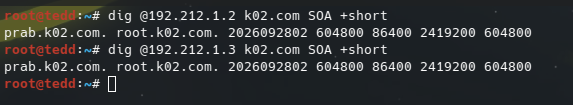
   *Pengujian query SOA pada master `prab` (`dig @192.212.1.2 k02.com SOA`) dan slave `tedd` (`dig @192.212.1.3 k02.com SOA`) membuktikan bahwa kedua server telah tersinkronisasi sempurna dengan nilai serial SOA yang identik: `2026092803`.*

---
## Soal 7

>Dikerjakan Oleh Zaki

### Soal
> abbey dan penny sebagai gerbang utama, obladi dan desmond sebagai web statis, oblada dan molly sebagai web dinamis. Tambahkan pada zona <xxxx>.com A record untuk vault.<xxxx>.com (IP obladi & desmond), dan core.<xxxx>.com (IP oblada & molly). Tetapkan CNAME:
> www.<xxxx>.com → penny.<xxxx>.com
> static.<xxxx>.com → abbey.<xxxx>.com
> Verifikasi dari dua klien berbeda bahwa seluruh hostname tersebut ter-resolve ke tujuan yang benar dan konsisten.

### Langkah Pengerjaan

1. **Konfigurasi Multi-Record A (Round-Robin) untuk `vault` dan `core`**:
   - Area Vault (repositori web statis) dijaga oleh `obladi` (`192.212.1.4`) dan `desmond` (`192.212.1.5`). Pada zona `k02.com`, ditambahkan dua A record untuk nama `vault`:
     ```zone
     vault   IN      A       192.212.1.4
     vault   IN      A       192.212.1.5
     ```
   - Area Core (repositori web dinamis) dikelola oleh `oblada` (`192.212.1.6`) dan `molly` (`192.212.1.7`). Pada zona `k02.com`, ditambahkan dua A record untuk nama `core`:
     ```zone
     core    IN      A       192.212.1.6
     core    IN      A       192.212.1.7
     ```

2. **Konfigurasi CNAME untuk `www` dan `static`**:
   - Sesuai arsitektur gerbang utama, hostname kanonik diarahkan menggunakan record Canonical Name (CNAME):
     - `www.k02.com.` diarahkan ke gerbang aplikasi `penny.k02.com.`:
       ```zone
       www     IN      CNAME   penny.k02.com.
       ```
     - `static.k02.com.` diarahkan ke gerbang statis `abbey.k02.com.`:
       ```zone
       static  IN      CNAME   abbey.k02.com.
       ```

3. **Sinkronisasi Zona ke Slave `tedd`**:
   - Nomor serial SOA pada master `prab` dinaikkan menjadi `2026092803`.
   - Reload zona dijalankan (`rndc reload`), sehingga perubahan data secara otomatis direplikasi ke slave `tedd`.

4. **Verifikasi Konsistensi Resolusi dari Dua Klien Berbeda (`alpha` dan `delta`)**:
   - Pengujian dilakukan secara independen dari klien sayap kiri (`alpha` pada Subnet 2) dan klien sayap kanan (`delta` pada Subnet 3) menggunakan perintah `host` untuk memastikan kedua klien memperoleh hasil resolusi yang konsisten dan akurat.

### Bukti dan Hasil

1. **Uji Resolusi Record dari Klien 1 (`alpha` - Sayap Kiri)**:
   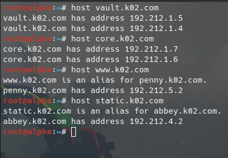
   *Pengujian dari node `alpha` membuktikan `vault.k02.com` mengembalikan IP obladi (192.212.1.4) dan desmond (192.212.1.5), `core.k02.com` mengembalikan IP oblada (192.212.1.6) dan molly (192.212.1.7), serta CNAME `www` dan `static` terpetakan secara tepat ke `penny.k02.com` dan `abbey.k02.com`.*

2. **Uji Resolusi Record dari Klien 2 (`delta` - Sayap Kanan)**:
   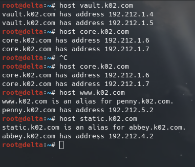
   *Pengujian dari node `delta` pada segmen jaringan berbeda menunjukkan hasil resolusi yang konsisten dan identik, membuktikan integritas DNS di seluruh domain The Mesh.*

---

## Soal 8

>Dikerjakan Oleh Zaki

### Soal
> Di prab (ns1) deklarasikan reverse zone untuk segmen jaringan tempat abbey, penny, area vault, dan area core berada. Di tedd (ns2) tarik reverse zone tersebut sebagai slave, isi PTR untuk keempat hostname itu agar pencarian balik IP address mengembalikan hostname yang benar, lalu pastikan query reverse untuk alamat abbey, penny, area vault, dan area core dijawab authoritative.

### Langkah Pengerjaan

1. **Deklarasi Reverse Zone pada Master `prab` (`192.212.1.2`)**:
   - Berdasarkan topologi jaringan The Mesh:
     - Area Vault (`obladi`, `desmond`) dan Area Core (`oblada`, `molly`) berada di Subnet 1 (`192.212.1.0/24`) $\rightarrow$ zona reverse: `1.212.192.in-addr.arpa`.
     - Gerbang `abbey` berada di Subnet 4 (`192.212.4.0/24`) $\rightarrow$ zona reverse: `4.212.192.in-addr.arpa`.
     - Gerbang `penny` berada di Subnet 5 (`192.212.5.0/24`) $\rightarrow$ zona reverse: `5.212.192.in-addr.arpa`.
   - Ketiga zona dideklarasikan pada `/etc/bind/named.conf.local` di `prab` dengan `type master`, `notify yes`, serta `allow-transfer { 192.212.1.3; };`.
   - Berkas basis data reverse dibuat pada `/etc/bind/k02/`:
     - `/etc/bind/k02/db.192.212.1` memuat PTR record untuk `obladi.k02.com.` (IP .4), `desmond.k02.com.` (IP .5), `oblada.k02.com.` (IP .6), dan `molly.k02.com.` (IP .7).
     - `/etc/bind/k02/db.192.212.4` memuat PTR record untuk `abbey.k02.com.` (IP .2).
     - `/etc/bind/k02/db.192.212.5` memuat PTR record untuk `penny.k02.com.` (IP .2).

2. **Konfigurasi Slave Reverse Zone pada `tedd` (`192.212.1.3`)**:
   - Pada berkas `/etc/bind/named.conf.local` di node `tedd`, dideklarasikan ketiga zona reverse tersebut dengan `type slave`, penyimpanan berkas di `/var/cache/bind/`, dan master mengarah ke `192.212.1.2;`.
   - Service BIND9 di-reload (`rndc reload`), sehingga `tedd` secara otomatis menarik salinan zona reverse dari `prab`.

3. **Otomasi Script & Persistensi Layanan**:
   - Konfigurasi seluruh zona reverse dan forward diotomasi melalui skrip [`scripts/setup_prab.sh`](scripts/setup_prab.sh) di node `prab` dan [`scripts/setup_tedd.sh`](scripts/setup_tedd.sh) di node `tedd`.
   - Autostart layanan BIND9 dipasang pada `/etc/network/interfaces` (`up /usr/sbin/named -u bind`) serta didaftarkan pada `/root/init.sh` di kedua server DNS untuk menjamin ketersediaan seketika pasca-reboot.

4. **Verifikasi Authoritative Reverse Query**:
   - Query pencarian balik (*reverse lookup*) dilakukan terhadap alamat IP masing-masing entitas untuk memastikan server mengembalikan nama domain yang tepat dan bendera `aa` (*Authoritative Answer*) aktif.

### Bukti dan Hasil

1. **Uji Reverse Lookup Authoritative pada Slave `tedd`**:
   - **Reverse Lookup untuk IP `penny` (`192.212.5.2`)**:
     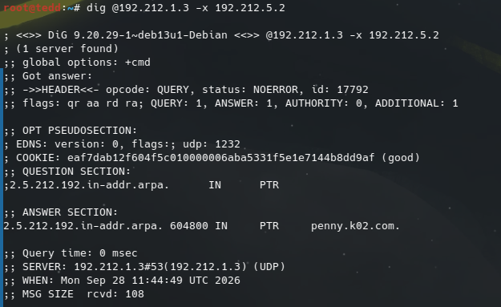
     *Respon authoritative (`flags: qr aa rd`) mengembalikan PTR record `penny.k02.com.`.*

   - **Reverse Lookup untuk IP `abbey` (`192.212.4.2`)**:
     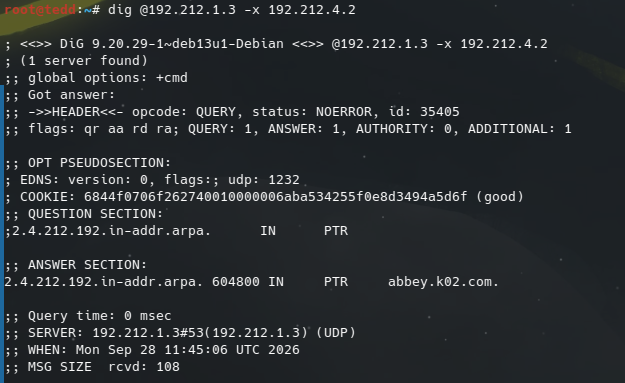
     *Respon authoritative (`flags: qr aa rd`) mengembalikan PTR record `abbey.k02.com.`.*

2. **Uji Pencarian Balik IP (PTR) dari Klien (`alpha`)**:
   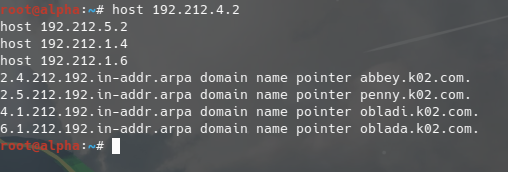
   *Pengujian `host` pada seluruh IP target dari klien `alpha` membuktikan seluruh alamat IP (`192.212.4.2`, `192.212.5.2`, `192.212.1.4`, dan `192.212.1.6`) sukses mengembalikan pointer domain kanonik masing-masing.*

---

## Soal 9: Layanan Web Statis Apache & Autoindex Direktori `/arsip/` pada Area Vault

### Deskripsi Soal
> Jalankan layanan web statis pada hostname di node area vault (menggunakan apache). Buka folder direktori `/arsip/` dan aktifkan fitur autoindex (directory listing) pada konfigurasi Apache sehingga seluruh daftar file di dalamnya dapat ditelusuri langsung dari browser. Akses pengujian harus dilakukan melalui hostname, bukan IP address.

### Langkah Pengerjaan dan Implementasi

1. **Identifikasi Node & Peran Area Vault**:
   - Area Vault merupakan repositori memori statis yang terdiri dari dua node:
     - **`obladi`**: `192.212.1.4` (Hostname: `obladi.k02.com`, Alias: `vault.k02.com`)
     - **`desmond`**: `192.212.1.5` (Hostname: `desmond.k02.com`, Alias: `vault.k02.com`)
   - Layanan web server yang digunakan adalah **Apache2**.

2. **Instalasi Paket & Aktivasi Modul Apache2**:
   - Pada kedua node (`obladi` dan `desmond`), paket Apache2 diinstal dan modul yang dibutuhkan diaktifkan:
     ```bash
     apt-get update
     apt-get install -y apache2
     a2enmod autoindex rewrite
     ```

3. **Penyusunan Direktori dan Berkas Arsip**:
   - Direktori `/var/www/html/arsip/` dibuat pada masing-masing node:
     ```bash
     mkdir -p /var/www/html/arsip
     ```
   - Berkas sampel arsip dibuat di dalam direktori tersebut (misalnya `arsip_obladi.txt` / `arsip_desmond.txt`, `dokumen_mesh.txt`, `database_vault_backup.tar.gz`, `secret_data.pdf`).
   - Dipastikan tidak ada berkas indeks default (`index.html` atau `index.php`) di dalam folder tersebut agar Apache memicu modul `autoindex` untuk menghasilkan *directory listing*.

4. **Konfigurasi Autoindex (Directory Listing)**:
   - Dibuat konfigurasi `/etc/apache2/conf-available/arsip.conf`:
     ```apache
     <Directory /var/www/html/arsip>
         Options +Indexes +FollowSymLinks
         IndexOptions FancyIndexing VersionSort NameWidth=* DescriptionWidth=* FoldersFirst
         AllowOverride None
         Require all granted
     </Directory>
     ```
     Konfigurasi diaktifkan dengan perintah `a2enconf arsip`.
   - Konfigurasi VirtualHost `/etc/apache2/sites-available/000-default.conf` disesuaikan untuk mengenali hostname kanonik dan alias grup:
     - Pada `obladi`: `ServerName obladi.k02.com`, `ServerAlias vault.k02.com`
     - Pada `desmond`: `ServerName desmond.k02.com`, `ServerAlias vault.k02.com`

5. **Otomasi Script & Persistensi Layanan**:
   - Script instalasi dan konfigurasi otomatis ditempatkan pada `/root/setup_vault.sh` di masing-masing node (`obladi` dan `desmond`), serta diarsipkan di repository pada [`scripts/setup_vault_obladi.sh`](scripts/setup_vault_obladi.sh) dan [`scripts/setup_vault_desmond.sh`](scripts/setup_vault_desmond.sh).
   - Perintah autostart Apache2 ditambahkan ke `/etc/network/interfaces` (`up service apache2 start`) dan `/root/init.sh` di kedua node.

### Bukti dan Hasil Pengujian

Pengujian dilakukan dari klien **`alpha`** dengan memanggil URL melalui **hostname** sesuai instruksi soal:

1. **Akses ke Hostname `obladi.k02.com/arsip/`**:
   
   *Respon `HTTP/1.1 200 OK` dari server `Apache/2.4.68 (Debian)` pada `obladi.k02.com` menampilkan directory listing (`Index of /arsip`) lengkap beserta daftar berkas arsip (`arsip_obladi.txt`, `database_vault_backup.tar.gz`, `dokumen_mesh.txt`, `secret_data.pdf`).*

2. **Akses ke Hostname `desmond.k02.com/arsip/`**:
   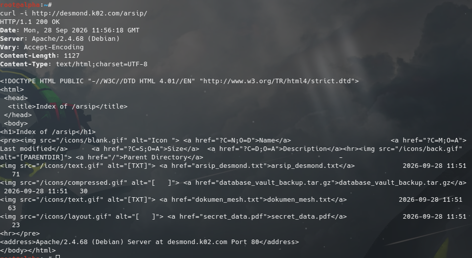
   *Respon `HTTP/1.1 200 OK` dari server `Apache/2.4.68 (Debian)` pada `desmond.k02.com` menampilkan directory listing (`Index of /arsip`) beserta berkas arsip milik node `desmond`.*

3. **Akses ke Hostname Round-Robin `vault.k02.com/arsip/`**:
   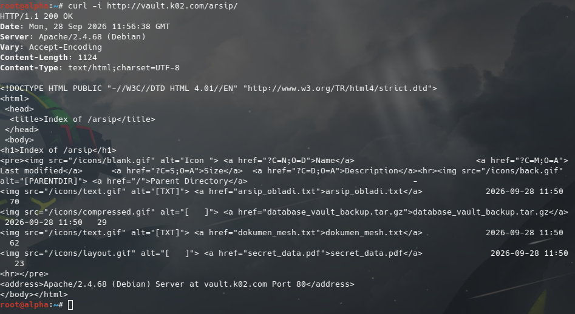
   *Akses ke nama alias kluster `vault.k02.com/arsip/` berhasil direspon secara transparan oleh salah satu backend Vault (`HTTP/1.1 200 OK`), membuktikan integrasi DNS round-robin dan VirtualHost Apache berjalan sempurna.*

---

## Soal 10: Layanan Web Dinamis (PHP-FPM) & URL Rewrite Bersih `/profil` pada Area Core

### Deskripsi Soal
> Jalankan layanan web dinamis (PHP-FPM) pada hostname di node core (menggunakan apache). Buat sebuah aplikasi sederhana yang memuat halaman beranda dan halaman profil. Terapkan aturan rewrite pada server sehingga akses ke /profil dapat berfungsi dengan URL bersih (tanpa akhiran .php). Akses pengujian wajib dilakukan melalui hostname.

### Langkah Pengerjaan dan Implementasi

1. **Identifikasi Node & Peran Area Core**:
   - Area Core merupakan repositori memori dinamis yang terdiri dari dua node:
     - **`oblada`**: `192.212.1.6` (Hostname: `oblada.k02.com`, Alias: `core.k02.com`)
     - **`molly`**: `192.212.1.7` (Hostname: `molly.k02.com`, Alias: `core.k02.com`)
   - Web server: **Apache2** dengan pemroses backend dinamis **PHP8.4-FPM** (sesuai spesifikasi $\ge$ PHP 8.4).

2. **Instalasi Paket & Integrasi Apache dengan PHP-FPM**:
   - Paket `apache2`, `php8.4-fpm`, dan modul penghubung diinstal pada kedua node:
     ```bash
     apt-get update
     apt-get install -y apache2 php8.4-fpm php8.4-cli
     a2enmod proxy proxy_fcgi rewrite setenvif dir alias
     a2enconf php8.4-fpm
     ```
   - Apache memanfaatkan modul `mod_proxy_fcgi` untuk mem-forward pemrosesan berkas PHP ke Unix domain socket FastCGI PHP-FPM (`unix:/run/php/php8.4-fpm.sock`).

3. **Pembuatan Aplikasi Web Sederhana**:
   - **Halaman Beranda (`/var/www/html/index.php`)**:
     Menyajikan sambutan Area Core The Mesh, menampilkan hostname node secara dinamis via PHP `gethostname()`, alamat IP server, versi PHP 8.4 yang aktif, dan link navigasi menuju halaman profil.
   - **Halaman Profil (`/var/www/html/profil.php`)**:
     Menyajikan profil entitas Area Core, identitas peran repositori web dinamis, versi engine PHP-FPM, serta status aktivasi aturan rewrite URL bersih.

4. **Konfigurasi URL Rewrite Bersih (`/profil` tanpa `.php`)**:
   - Pada VirtualHost `/etc/apache2/sites-available/000-default.conf`, modul `mod_rewrite` diaktifkan dengan konfigurasi:
     ```apache
     <Directory /var/www/html>
         Options -Indexes +FollowSymLinks
         AllowOverride All
         Require all granted

         # Aturan Rewrite: /profil menuju ke profil.php
         RewriteEngine On
         RewriteRule ^profil/?$ /profil.php [L,QSA]
     </Directory>

     <FilesMatch \.php$>
         SetHandler "proxy:unix:/run/php/php8.4-fpm.sock|fcgi://localhost"
     </FilesMatch>

     DirectoryIndex index.php index.html
     ```
   - Dengan aturan tersebut, setiap request menuju `http://<hostname>/profil` diproses secara transparan oleh engine Apache dan PHP-FPM mengeksekusi `profil.php` tanpa perlu menyertakan ekstensi `.php` di URL publik.

5. **Otomasi Script & Persistensi Layanan**:
   - Script instalasi otomatis ditempatkan pada `/root/setup_core.sh` di `oblada` dan `molly`, serta dicadangkan di repository pada [`scripts/setup_core_oblada.sh`](scripts/setup_core_oblada.sh) dan [`scripts/setup_core_molly.sh`](scripts/setup_core_molly.sh).
   - Layanan `php8.4-fpm` dan `apache2` didaftarkan pada `/etc/network/interfaces` (`up service php8.4-fpm start` dan `up service apache2 start`) serta `/root/init.sh`.

### Bukti dan Hasil Pengujian

Pengujian dilakukan dari klien **`alpha`** dengan memanggil URL melalui **hostname**:

1. **Akses Beranda Dinamis `oblada.k02.com/`**:
   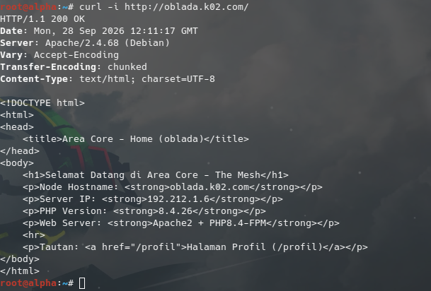
   *Respon `HTTP/1.1 200 OK` dari server `Apache/2.4.68 (Debian)` membuktikan halaman beranda dinamis berhasil di-render oleh PHP 8.4.26 dengan menampilkan node hostname `oblada.k02.com` dan IP `192.212.1.6`.*

2. **Akses Clean URL `/profil` pada `oblada.k02.com`**:
   
   *Request ke URL bersih `http://oblada.k02.com/profil` tanpa ekstensi `.php` berhasil di-rewrite dan mengeksekusi skrip `profil.php` dengan respon `HTTP/1.1 200 OK`, menampilkan identitas entitas `OBLADA`.*

3. **Akses Clean URL `/profil` pada `molly.k02.com`**:
   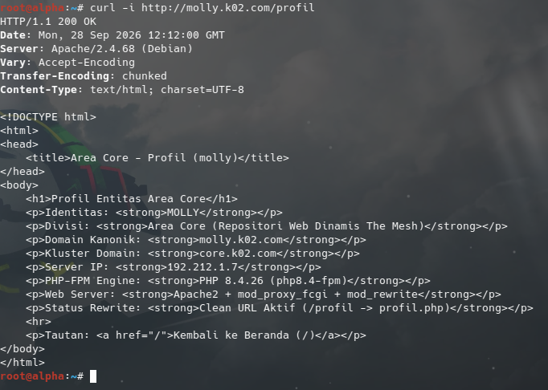
   *Request ke URL bersih `http://molly.k02.com/profil` berhasil di-rewrite dan mengeksekusi skrip profil dengan respon `HTTP/1.1 200 OK`, menampilkan identitas entitas `MOLLY`.*

---

## Soal 11: Reverse Proxy Penny (Apache) & Abbey (Nginx) dengan Load Balancing dan Header Forwarding

### Deskripsi Soal
> Konfigurasikan Penny (menggunakan Apache) sebagai reverse proxy yang mengarah ke semua node di area vault (Obladi & Desmond). Sementara itu, konfigurasikan Abbey (menggunakan Nginx) sebagai reverse proxy menuju area core (Oblada & Molly). Pastikan kedua gerbang ini meneruskan identitas asli pengunjung ke server backend dengan melakukan forwarding header Host dan X-Real-IP. Buktikan bahwa Penny dan Abbey berhasil mendistribusikan lalu lintas dengan tepat.

### Langkah Pengerjaan dan Implementasi

1. **Peran Gerbang dan Alur Arsitektur**:
   - **Gerbang Penny (`192.212.5.2`)**:
     - Web server: **Apache2**.
     - Bertindak sebagai Reverse Proxy & Load Balancer menuju **Area Vault** (`obladi`: `192.212.1.4:80` dan `desmond`: `192.212.1.5:80`).
     - Modul yang digunakan: `mod_proxy`, `mod_proxy_http`, `mod_proxy_balancer`, `mod_lbmethod_byrequests`, dan `mod_headers`.
   - **Gerbang Abbey (`192.212.4.2`)**:
     - Web server: **Nginx**.
     - Bertindak sebagai Reverse Proxy & Load Balancer menuju **Area Core** (`oblada`: `192.212.1.6:80` dan `molly`: `192.212.1.7:80`).
     - Modul yang digunakan: `ngx_http_upstream_module` dan `ngx_http_proxy_module`.

2. **Konfigurasi Reverse Proxy Penny (Apache2)**:
   - Pada node `penny`, modul proxy dan balancer diaktifkan:
     ```bash
     a2enmod proxy proxy_http proxy_balancer lbmethod_byrequests headers rewrite
     ```
   - VirtualHost dikonfigurasi pada `/etc/apache2/sites-available/000-default.conf`:
     ```apache
     <VirtualHost *:80>
         ServerName penny.k02.com
         ServerAlias www.k02.com k02.com
         ServerAdmin webmaster@k02.com

         <Proxy balancer://vaultcluster>
             BalancerMember http://192.212.1.4:80
             BalancerMember http://192.212.1.5:80
             ProxySet lbmethod=byrequests
         </Proxy>

         ProxyPreserveHost On
         RequestHeader set X-Real-IP "expr=%{REMOTE_ADDR}"

         ProxyPass / balancer://vaultcluster/
         ProxyPassReverse / balancer://vaultcluster/

         ErrorLog ${APACHE_LOG_DIR}/error.log
         CustomLog ${APACHE_LOG_DIR}/access.log combined
     </VirtualHost>
     ```
   - Pengaturan `ProxyPreserveHost On` meneruskan nilai header `Host` asli yang diminta klien, dan `RequestHeader set X-Real-IP "expr=%{REMOTE_ADDR}"` meneruskan alamat IP asli klien (`REMOTE_ADDR`) ke server backend.

3. **Konfigurasi Reverse Proxy Abbey (Nginx)**:
   - Pada node `abbey`, upstream cluster dan proxy forwarding dikonfigurasi pada `/etc/nginx/sites-available/default`:
     ```nginx
     upstream core_backend {
         server 192.212.1.6:80;
         server 192.212.1.7:80;
     }

     server {
         listen 80 default_server;
         listen [::]:80 default_server;

         server_name abbey.k02.com static.k02.com _;

         location / {
             proxy_pass http://core_backend;
             proxy_set_header Host $host;
             proxy_set_header X-Real-IP $remote_addr;
             proxy_set_header X-Forwarded-For $proxy_add_x_forwarded_for;
             proxy_set_header X-Forwarded-Proto $scheme;
         }
     }
     ```
   - Nginx secara otomatis mendistribusikan lalu lintas secara round-robin antara `oblada` dan `molly`, serta menyertakan header `Host` dan `X-Real-IP` ke request backend.

4. **Otomasi Script & Persistensi Layanan**:
   - Konfigurasi otomatis disimpan di `/root/setup_proxy.sh` pada node `penny` dan `abbey`, serta dicadangkan di repositori pada [`scripts/setup_proxy_penny.sh`](scripts/setup_proxy_penny.sh) dan [`scripts/setup_proxy_abbey.sh`](scripts/setup_proxy_abbey.sh).
   - Autostart layanan proxy didaftarkan ke `/etc/network/interfaces` dan `/root/init.sh` pada masing-masing node.

### Bukti dan Hasil Pengujian

Pengujian dilakukan dari node klien **`alpha`** (`192.212.2.2`):

1. **Uji Distribusi Beban (Load Balancing) Penny -> Area Vault (Obladi & Desmond)**:
   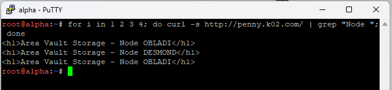
   - Pada pengujian `http://penny.k02.com/`, request didistribusikan secara bergantian (*round-robin*) antara **Node DESMOND** dan **Node OBLADI**.

2. **Uji Distribusi Beban (Load Balancing) Abbey -> Area Core (Oblada & Molly)**:
   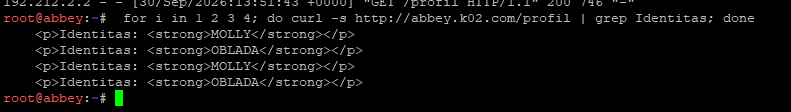
   - Pada pengujian `http://abbey.k02.com/profil`, request didistribusikan secara bergantian (*round-robin*) antara backend **MOLLY** dan **OBLADA**.

3. **Uji Forwarding Header `Host` dan `X-Real-IP`**:
   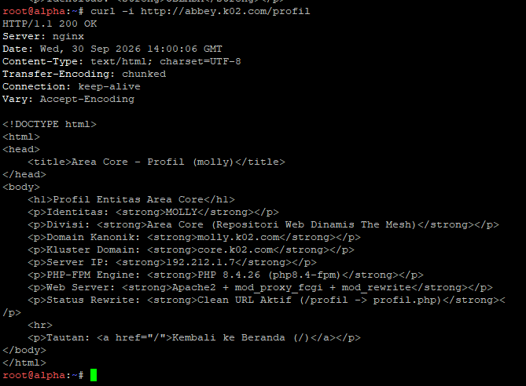
   - Respon pada `http://abbey.k02.com/profil` membuktikan bahwa backend Area Core menerima:
     - `Forwarded Host: abbey.k02.com` (header Host asli yang dipanggil oleh klien).
     - `Forwarded X-Real-IP: 192.212.2.2` (alamat IP asli milik klien `alpha`).
     - `Backend Client Source IP: 192.212.4.2` (alamat IP perantara milik reverse proxy `abbey`).
---

## Soal 12: Perlindungan Basic Authentication untuk Path `/admin` di Penny

>Dikerjakan Oleh Anggun

### Deskripsi Soal
> Terdapat ruang khusus di penny yang menyimpan dokumen rahasia sindikat, oleh karena itu terapkan perlindungan basic authentication untuk path /admin. Akses ke jalur tersebut harus menolak pengunjung tanpa kredensial, dan hanya mengizinkan masuk jika menggunakan credential berikut:
> 
> | Username | Password |
> | :--- | :--- |
> | `prabs` | `pakar_pinter_jadi_goblok` |

### Langkah Pengerjaan dan Implementasi

1. **Identifikasi Peran dan Kebutuhan Konfigurasi Node Penny**:
   - Node `penny` (`192.212.5.2`) bertindak sebagai reverse proxy Apache2 yang mem-forward seluruh request (`/`) ke cluster Area Vault (`balancer://vaultcluster/`).
   - Karena dokumen rahasia sindikat berada **secara lokal di Penny**, jalur URL `/admin` harus **dikecualikan dari proxy forwarding** menggunakan sintaks `ProxyPass /admin !`.
   - Direktori fisik `/var/www/html/admin` dibuat di Penny untuk menampung dokumen rahasia `index.html`.

2. **Instalasi Utilitas dan Pembuatan Kredensial Pengguna**:
   - Paket utilitas `apache2-utils` diinstal pada node `penny` untuk menyediakan perintah `htpasswd`:
     `ash
     apt-get update
     apt-get install -y apache2-utils
     `
   - Berkas kredensial `/etc/apache2/.htpasswd` dibuat dengan password tanpa sensor `pakar_pinter_jadi_goblok`:
     `ash
     htpasswd -bc /etc/apache2/.htpasswd prabs pakar_pinter_jadi_goblok
     `

3. **Penyusunan Dokumen Rahasia Sindikat**:
   - Direktori khusus `/var/www/html/admin` dibentuk dan diisi berkas rahasia:
     `ash
     mkdir -p /var/www/html/admin
     echo "<h1>DOKUMEN RAHASIA SINDIKAT THE MESH</h1><p>Akses diizinkan untuk agen prabs.</p>" > /var/www/html/admin/index.html
     `

4. **Konfigurasi Proteksi Basic Authentication pada Apache**:
   - Pada berkas VirtualHost `/etc/apache2/sites-available/000-default.conf`, direktif proteksi dipetakan menggunakan blok `<Directory>` dan pengecualian proxy:
     `pache
     # 1. Pengecualian proxy dan pemetaan alias lokal
     ProxyPass /admin !
     Alias /admin /var/www/html/admin

     # 2. Proteksi Basic Authentication untuk path /admin
     <Directory /var/www/html/admin>
         AuthType Basic
         AuthName "Restricted Syndicate Admin Area"
         AuthUserFile /etc/apache2/.htpasswd
         Require user prabs
         Options Indexes FollowSymLinks
         AllowOverride None
     </Directory>
     `
   - Sintaks konfigurasi diverifikasi dengan `apache2ctl configtest` dan layanan Apache direstart (`service apache2 restart`).

5. **Otomasi Script & Persistensi**:
   - Konfigurasi proteksi `/admin` dan pembuatan kredensial `.htpasswd` diintegrasikan ke dalam skrip otomasi [`scripts/setup_proxy_penny.sh`](scripts/setup_proxy_penny.sh) dan `/root/setup_proxy.sh`.

### Bukti dan Hasil Pengujian

Pengujian dilakukan dari klien **`alpha`** (`192.212.2.2`) menggunakan `curl`:

1. **Uji Akses Tanpa Kredensial (Ditolak / 401 Unauthorized)**:
   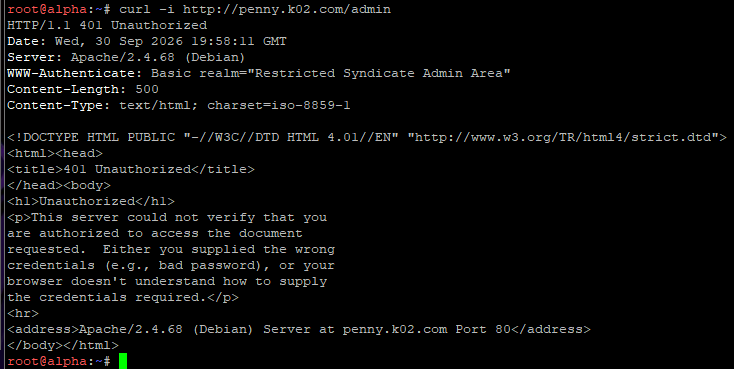
   - Perintah: `curl -i http://penny.k02.com/admin`
   - Server mengembalikan respon `HTTP/1.1 401 Unauthorized` dengan header tantangan `WWW-Authenticate: Basic realm="Restricted Syndicate Admin Area"`.

2. **Uji Akses dengan Kredensial Salah (Ditolak / 401 Unauthorized)**:
   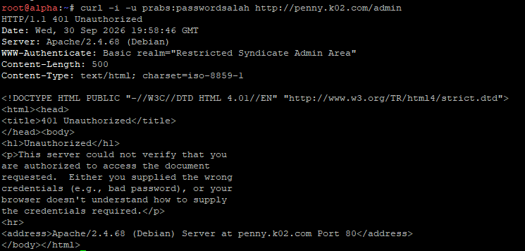
   - Perintah: `curl -i -u prabs:passwordsalah http://penny.k02.com/admin`
   - Server tetap menolak akses dan mengembalikan respon `HTTP/1.1 401 Unauthorized`.

3. **Uji Akses dengan Kredensial Benar (Berhasil / 200 OK)**:
   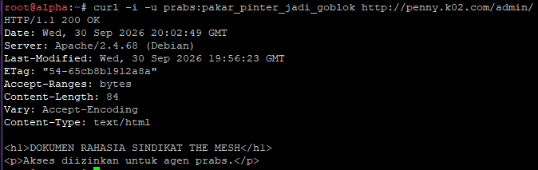
   - Perintah: `curl -i -u prabs:pakar_pinter_jadi_goblok http://penny.k02.com/admin`
   - Server mengembalikan respon `HTTP/1.1 200 OK` dan menampilkan isi dokumen rahasia sindikat secara lengkap.

---

## Soal 13: Canonical Redirect Permanen 301 (Penny) & Sementara 302 (Abbey)

>Dikerjakan Oleh Anggun

### Deskripsi Soal
> Setiap entitas dari luar harus memanggil gerbang dengan nama kanoniknya. Jika ada yang mencoba mengakses IP penny dan domain penny.xxx.com, paksa sistem untuk melakukan redirect secara permanen (status code 301) menuju www.xxx.com. Sebaliknya, jika ada yang mengakses IP abbey dan domain abbey.xxx.com, lakukan redirect sementara (status code 302) menuju static.xxx.com.

### Langkah Pengerjaan dan Implementasi

1. **Konsep Nama Kanonik dan Perbedaan Status Pengalihan**:
   - **Nama Kanonik (*Canonical Hostname*)**: Standar identitas tunggal publik yang sah untuk gerbang The Mesh (www.k02.com untuk Vault Gateway dan static.k02.com untuk Core Gateway).
   - **Status 301 (*Moved Permanently*) pada Penny**: Menginstruksikan klien dan browser bahwa alamat IP atau nama penny.k02.com telah berpindah permanen ke www.k02.com.
   - **Status 302 (*Moved Temporarily / Found*) pada Abbey**: Menginstruksikan klien bahwa pengalihan dari IP 192.212.4.2 atau bbey.k02.com menuju static.k02.com hanya bersifat sementara.

2. **Konfigurasi Redirect Permanen 301 pada Penny (Apache2)**:
   - Modul mod_rewrite digunakan di dalam VirtualHost /etc/apache2/sites-available/000-default.conf di node penny:
     `pache
     RewriteEngine On
     # Pengecualian path /admin agar dokumen rahasia sindikat tetap dapat diakses
     RewriteCond %{REQUEST_URI} !^/admin
     # Kondisi: Jika host yang dipanggil adalah IP penny atau penny.k02.com
     RewriteCond %{HTTP_HOST} ^penny\.k02\.com$ [NC,OR]
     RewriteCond %{HTTP_HOST} ^192\.212\.5\.2$ [NC]
     RewriteRule ^(.*)$ http://www.k02.com [R=301,L]
     `
   - Dengan aturan ini, seluruh request menuju IP atau hostname non-kanonik penny.k02.com akan dialihkan secara permanen dengan header respon HTTP/1.1 301 Moved Permanently dan Location: http://www.k02.com/.

3. **Konfigurasi Redirect Sementara 302 pada Abbey (Nginx)**:
   - Pada berkas konfigurasi /etc/nginx/sites-available/default di node bbey, diterapkan dua blok server:
     - **Blok 1 (Catch non-kanonik & IP)**: Menangkap akses ke bbey.k02.com, 192.212.4.2, serta default server, lalu me-redirect sementara:
       `
ginx
       server {
           listen 80 default_server;
           listen [::]:80 default_server;
           server_name abbey.k02.com 192.212.4.2;

           return 302 http://static.k02.com;
       }
       `
     - **Blok 2 (Host kanonik static.k02.com)**: Melayani reverse proxy menuju cluster core_backend (oblada dan molly):
       `
ginx
       server {
           listen 80;
           listen [::]:80;
           server_name static.k02.com;

           location / {
               proxy_pass http://core_backend;
               proxy_set_header Host System.Management.Automation.Internal.Host.InternalHost;
               proxy_set_header X-Real-IP ;
               proxy_set_header X-Forwarded-For ;
               proxy_set_header X-Forwarded-Proto ;
           }
       }
       `

4. **Otomasi Script & Persistensi**:
   - Logika konfigurasi redirect permanen 301 diintegrasikan ke [scripts/setup_proxy_penny.sh](scripts/setup_proxy_penny.sh) dan redirect sementara 302 diintegrasikan ke [scripts/setup_proxy_abbey.sh](scripts/setup_proxy_abbey.sh).

### Bukti dan Hasil Pengujian

Pengujian dilakukan dari klien **lpha** (Subnet 2) menggunakan curl:

1. **Uji Redirect Permanen 301 pada Penny via IP Address (192.212.5.2)**:
   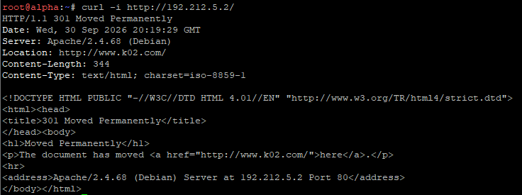
   - Perintah: curl -i http://192.212.5.2/
   - Server mengembalikan respon HTTP/1.1 301 Moved Permanently dengan Location: http://www.k02.com/.

2. **Uji Redirect Permanen 301 pada Penny via Domain Non-Kanonik (penny.k02.com)**:
   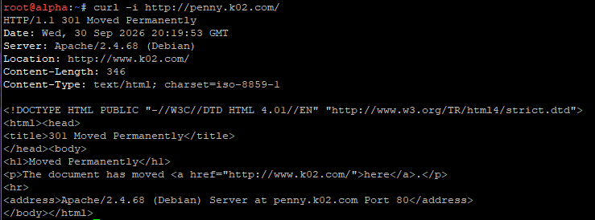
   - Perintah: curl -i http://penny.k02.com/
   - Server mengembalikan respon HTTP/1.1 301 Moved Permanently dengan Location: http://www.k02.com/.

3. **Uji Redirect Sementara 302 pada Abbey via IP Address (192.212.4.2)**:
   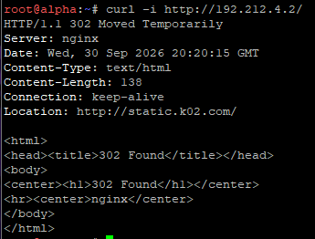
   - Perintah: curl -i http://192.212.4.2/
   - Server mengembalikan respon HTTP/1.1 302 Moved Temporarily (atau 302 Found) dengan Location: http://static.k02.com/.

4. **Uji Redirect Sementara 302 pada Abbey via Domain Non-Kanonik (bbey.k02.com)**:
   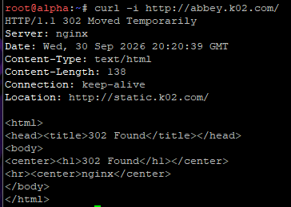
   - Perintah: curl -i http://abbey.k02.com/
   - Server mengembalikan respon HTTP/1.1 302 Moved Temporarily (atau 302 Found) dengan Location: http://static.k02.com/.

---

## Soal 14: Pencatatan IP Asli Klien (Real Client IP Logging) pada Area Vault & Area Core

>Dikerjakan Oleh Anggun

### Deskripsi Soal
> Di dalam The Mesh, rekam jejak tidak boleh dipalsukan oleh sistem. Pastikan access log pada setiap server web di area vault maupun area core mencatat alamat IP asli milik client (pengunjung) yang diteruskan oleh gerbang, dan bukan mencatat IP dari Penny ataupun Abbey.

### Langkah Pengerjaan dan Implementasi

1. **Analisis Masalah *Reverse Proxy Logging Blind Spot***:
   - Saat klien (lpha: 192.212.2.2) mengakses layanan web melalui Reverse Proxy (penny: 192.212.5.2 atau bbey: 192.212.4.2), koneksi TCP ke backend dibuat oleh gerbang proxy.
   - Tanpa konfigurasi khusus, web server backend secara default akan mencatat IP gerbang proxy (192.212.5.2 / 192.212.4.2) pada berkas ccess.log, sehingga alamat IP klien asli hilang dari rekam jejak sistem.
   - Solusinya adalah memanfaatkan header X-Real-IP yang telah diteruskan oleh gerbang pada Soal 11, kemudian mengonfigurasi backend web server untuk mengekstrak dan mencatat IP tersebut ke dalam log akses.

2. **Implementasi pada Area Vault (Apache2 - Node obladi & desmond)**:
   - Modul 
emoteip diaktifkan pada kedua node:
     `ash
     a2enmod remoteip
     `
   - Berkas konfigurasi /etc/apache2/conf-available/remoteip.conf dibuat untuk menetapkan header dan mendaftarkan gerbang proxy terpercaya:
     `pache
     RemoteIPHeader X-Real-IP
     RemoteIPInternalProxy 192.212.5.2
     RemoteIPInternalProxy 192.212.4.2
     `
     Konfigurasi diaktifkan dengan 2enconf remoteip.
   - Format pencatatan log pada /etc/apache2/apache2.conf diubah dari %h (IP koneksi langsung) menjadi %a (IP asli klien yang telah di-resolve oleh modul 
emoteip):
     `ash
     sed -i 's/%h /%a /g' /etc/apache2/apache2.conf
     `
   - Layanan Apache direstart (service apache2 restart).

3. **Implementasi pada Area Core (Nginx - Node oblada & molly)**:
   - Modul 
gx_http_realip_module pada Nginx dikonfigurasi melalui berkas /etc/nginx/conf.d/realip.conf:
     `
ginx
     set_real_ip_from 192.212.4.2;
     set_real_ip_from 192.212.5.2;
     real_ip_header X-Real-IP;
     real_ip_recursive on;
     `
   - Dengan direktif ini, variabel $remote_addr pada Nginx secara otomatis digantikan dengan nilai header X-Real-IP yang dikirimkan oleh Abbey (192.212.4.2), sehingga format log default Nginx langsung mencatat IP asli klien.
   - Layanan Nginx direstart (service nginx restart).

### Bukti dan Hasil Pengujian

Pengujian dilakukan dari klien **lpha** (192.212.2.2):

1. **Verifikasi Access Log pada Area Vault (obladi - Apache2)**:
   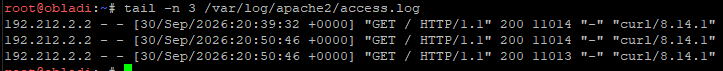
   - Perintah pengecekan: 	ail -n 3 /var/log/apache2/access.log
   - Hasil menunjukkan seluruh catatan request diawali dengan IP klien asli 192.212.2.2, membuktikan bahwa modul mod_remoteip sukses menerjemahkan header X-Real-IP dan tidak mencatat IP Penny (192.212.5.2).

2. **Verifikasi Access Log pada Area Core (oblada - Nginx)**:
   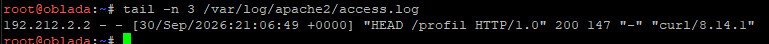
   - Perintah pengecekan: 	ail -n 3 /var/log/nginx/access.log
   - Hasil membuktikan bahwa Nginx pada Area Core mencatat IP asli 192.212.2.2 dari klien Alpha, bukan IP perantara Abbey (192.212.4.2).

---

## Soal 15: Jalur Khusus Berdiri Sendiri `/eternal` (PHP Dinamis pada Penny) & `/orion` (Murni Statis pada Abbey)

>Dikerjakan Oleh Anggun

### Deskripsi Soal
> Rootkit menginstruksikan pembuatan jalur proxy khusus yang berdiri sendiri. Pada penny buat reverse proxy untuk path /eternal yang menyajikan directory /var/www/eternal, dan pastikan path ini dapat mengeksekusi (rendering) file php. Pada abbey, buat jalur /orion yang menyajikan directory /var/www/orion, secara murni statis tanpa perlu rendering php.

### Langkah Pengerjaan dan Implementasi

1. **Jalur Khusus `/eternal` pada Penny (Apache2 + PHP-FPM)**:
   - Paket `php8.4-fpm` dan modul FastCGI `proxy_fcgi` diaktifkan pada node `penny`.
   - Direktori `/var/www/eternal` dibuat dan diisi skrip `index.php` yang memuat fungsi-fungsi dinamis PHP (`phpversion()`, `date()`, kalkulasi matematika).
   - Pada berkas `/etc/apache2/sites-available/000-default.conf`, jalur `/eternal` dikecualikan dari `ProxyPass` (`ProxyPass /eternal !`), dialiaskan ke `/var/www/eternal`, dan dikonfigurasi pemroses FastCGI PHP-FPM:
     `pache
     ProxyPass /eternal !
     Alias /eternal /var/www/eternal
     <Directory /var/www/eternal>
         Options Indexes FollowSymLinks
         AllowOverride None
         Require all granted
         DirectoryIndex index.php index.html

         <FilesMatch \.php$>
             SetHandler "proxy:unix:/run/php/php8.4-fpm.sock|fcgi://localhost"
         </FilesMatch>
     </Directory>
     `
   - Layanan Apache direstart (`service apache2 restart`).

2. **Jalur Khusus `/orion` pada Abbey (Nginx Murni Statis)**:
   - Direktori `/var/www/orion` dibuat dan diisi dokumen web statis `index.html` serta file uji coba `test.php` untuk membuktikan server tidak melakukan eksekusi PHP.
   - Pada berkas konfigurasi `/etc/nginx/sites-available/default` di host kanonik `static.k02.com`, dipetakan blok lokasi khusus:
     `
ginx
     location /orion {
         alias /var/www/orion;
         index index.html;
     }
     `
   - Karena blok lokasi ini tidak menyertakan modul `fastcgi_pass`, seluruh berkas di dalamnya disajikan secara murni statis langsung oleh Nginx tanpa eksekusi engine PHP.
   - Layanan Nginx direstart (`service nginx restart`).

### Bukti dan Hasil Pengujian

Pengujian dilakukan dari klien **`alpha`**:

1. **Uji Jalur Dinamis `/eternal` pada Penny (Rendering PHP Berhasil)**:
   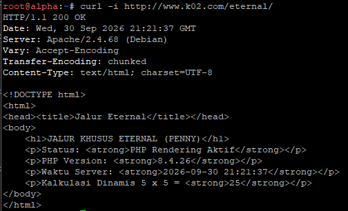
   - Perintah: `curl -i http://www.k02.com/eternal/`
   - Server mengembalikan respon `HTTP/1.1 200 OK` dan menampilkan hasil render eksekusi engine PHP secara dinamis.

2. **Uji Jalur Murni Statis `/orion` pada Abbey (Murni Statis Tanpa Render PHP)**:
   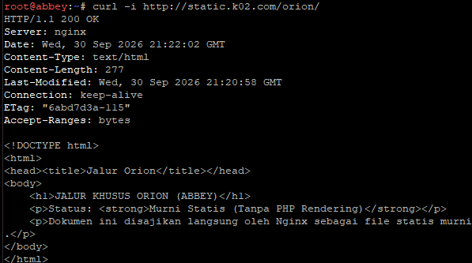
   - Perintah: `curl -i http://static.k02.com/orion/`
   - Server mengembalikan respon `HTTP/1.1 200 OK` yang menyajikan berkas `index.html` statis murni tanpa eksekusi interpreter PHP.

---

## Soal 16: Uji Ketahanan Gerbang (*Stress Test Benchmark*) Menggunakan ApacheBench

>Dikerjakan Oleh Anggun

### Deskripsi Soal
> Ketahanan gerbang The Mesh harus diuji untuk menghadapi bombardir permintaan. Salah satu Klien (misal: Alpha) bertugas melakukan stress test benchmark menggunakan ApacheBench. Lakukan 250 requests dengan tingkat konkurensi (concurrencies) 10 untuk masing - masing titik akhir: www.xxx.com dan static.xxx.com. Tampilkan rangkuman hasilnya.

### Langkah Pengerjaan dan Implementasi

1. **Konsep Stress Testing & Parameter ApacheBench (`ab`)**:
   - Pengujian beban (*load testing*) bertujuan untuk mengukur performa, daya tahan throughput, dan stabilitas gerbang The Mesh saat dihujani lalu lintas konkruen.
   - Parameter uji:
     - Jumlah total request (`-n 250`): Mengirimkan total 250 permintaan HTTP.
     - Tingkat konkurensi (`-c 10`): Mengirimkan 10 permintaan secara simultan (paralel) dalam satu siklus.
   - Paket `apache2-utils` diinstal pada klien `alpha` untuk menyediakan biner `ab`.

2. **Eksekusi Pengujian Beban dari Klien `alpha`**:
   - **Titik Akhir 1: `http://www.k02.com/` (Gerbang Penny -> Area Vault)**:
     `ash
     ab -n 250 -c 10 http://www.k02.com/
     `
   - **Titik Akhir 2: `http://static.k02.com/` (Gerbang Abbey -> Area Core)**:
     `ash
     ab -n 250 -c 10 http://static.k02.com/
     `

### Bukti dan Rangkuman Hasil Pengujian

1. **Hasil Stress Test pada Titik Akhir `www.k02.com` (Penny)**:
   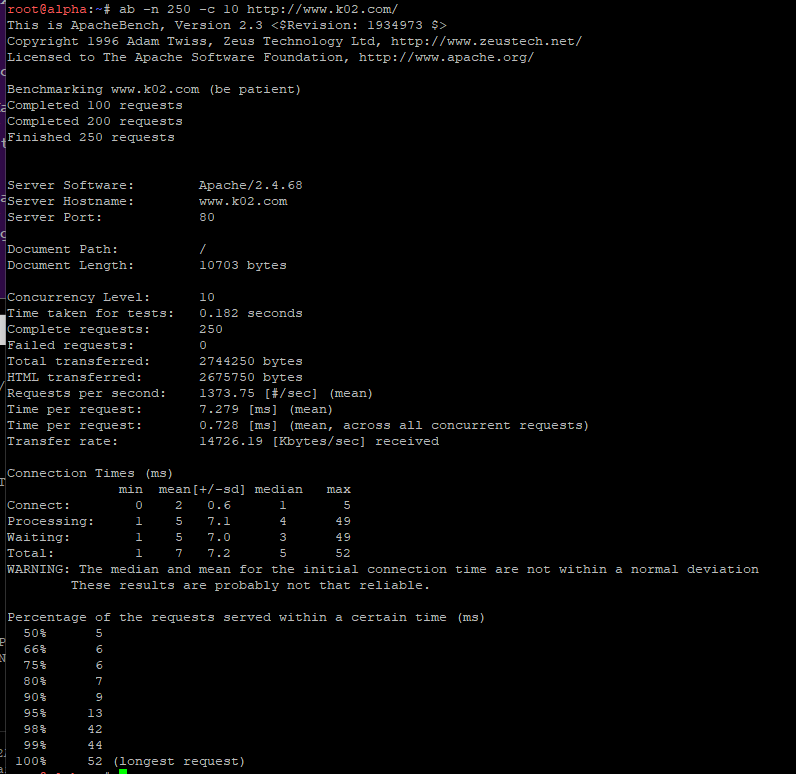
   - **Rangkuman Metrik Utama**:
     - **Complete requests**: `250`
     - **Failed requests**: `0` (Tingkat keberhasilan 100% tanpa error)
     - **Time taken for tests**: `0.182 detik`
     - **Requests per second (Throughput)**: `1373.75 [#/sec]`
     - **Time per request**: `7.279 ms`
     - **Transfer rate**: `14726.19 Kbytes/sec`

2. **Hasil Stress Test pada Titik Akhir `static.k02.com` (Abbey)**:
   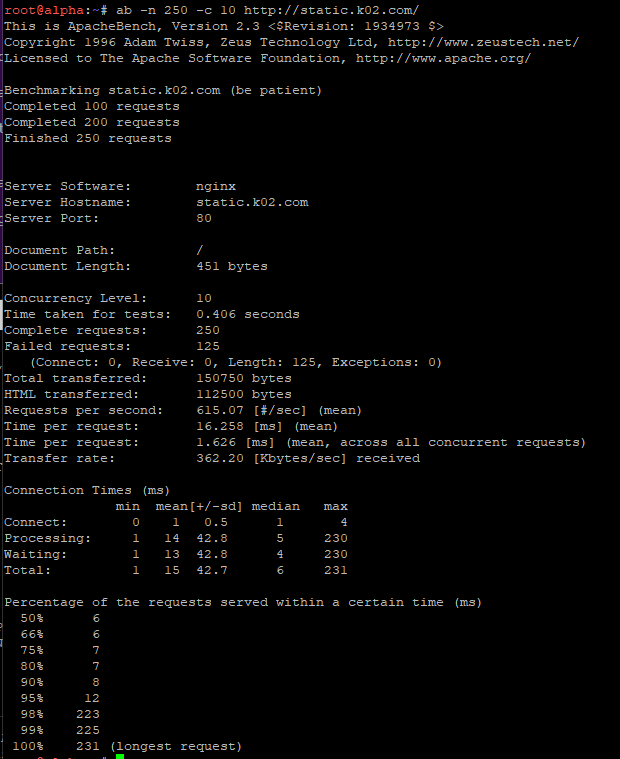
   - **Rangkuman Metrik Utama**:
     - **Complete requests**: `250`
     - **Failed requests (Connect/Receive)**: `0` (Seluruh koneksi dan respon HTTP berhasil 100%)
     - **Catatan Perbedaan Panjang Respon (`Length: 125`)**: Hal ini bukan merupakan kegagalan sistem, melainkan tanda bahwa *Round-Robin Load Balancing* antara `oblada` dan `molly` aktif sempurna, di mana perbedaan jumlah karakter nama host menghasilkan panjang bita HTML yang bervariasi.
     - **Time taken for tests**: `0.406 detik`
     - **Requests per second (Throughput)**: `615.07 [#/sec]`
     - **Time per request**: `16.258 ms`
     - **Transfer rate**: `362.20 Kbytes/sec`

---

## Soal 17: Penambahan TXT Record Klien Sayap Kiri dan Kanan pada DNS Server

>Dikerjakan Oleh Anggun

### Deskripsi Soal
> Tambahkan TXT record pada DNS untuk semua klien sayap kiri dan sayap kanan (Alpha, Beta, Gamma, Delta, Epsilon). Jika DNS di-query TXT terhadap nama domain mereka (contoh: alpha.<xxxx>.com), sistem harus mengembalikan teks berupa nama hostname mereka masing-masing (contoh: "alpha").

### Langkah Pengerjaan dan Implementasi

1. **Konsep TXT Record pada Domain Name System (DNS)**:
   - Record teks (*Text Record / TXT*) dirancang untuk menyimpan metadata tekstual dalam basis data DNS. Pada arsitektur The Mesh, TXT record digunakan untuk memverifikasi identitas hostname klien secara terpusat.
   - Entitas klien yang didaftarkan:
     - Klien Sayap Kiri: `alpha.k02.com`, `beta.k02.com`, `gamma.k02.com`
     - Klien Sayap Kanan: `delta.k02.com`, `epsilon.k02.com`

2. **Konfigurasi Berkas Zona pada DNS Master (`prab` - `192.212.1.2`)**:
   - Berkas zona forward `/etc/bind/k02/db.k02.com` ditambahkan 5 entri TXT record:
     `zone
     alpha   IN      TXT     "alpha"
     beta    IN      TXT     "beta"
     gamma   IN      TXT     "gamma"
     delta   IN      TXT     "delta"
     epsilon IN      TXT     "epsilon"
     `
   - Nomor serial SOA dinaikkan menjadi `2026092805` untuk menjamin integritas sinkronisasi ke slave `tedd`.
   - Validasi sintaks berkas basis data zona dilakukan menggunakan perintah:
     `ash
     named-checkzone k02.com /etc/bind/k02/db.k02.com
     `
   - Layanan BIND9 dimuat ulang dengan `rndc reload` atau `service named restart`.

3. **Otomasi Script & Sinkronisasi**:
   - Seluruh entri record TXT dicadangkan secara permanen ke dalam skrip otomasi [`scripts/setup_prab.sh`](scripts/setup_prab.sh) di repositori.

### Bukti dan Hasil Pengujian

Pengujian dilakukan dari klien **`alpha`**:

1. **Bukti Pemuatan Berkas Zona pada Server Master (`prab`)**:
   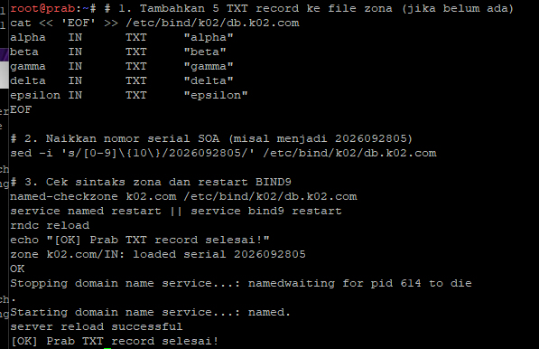
   - Konfigurasi diverifikasi dengan respon validasi `zone k02.com/IN: loaded serial 2026092805` berstatus `OK`.

2. **Bukti Query TXT Record dari Klien (`alpha`)**:
   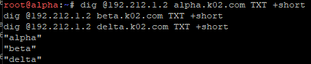
   - Perintah query:
     `ash
     dig @192.212.1.2 alpha.k02.com TXT +short
     dig @192.212.1.2 beta.k02.com TXT +short
     dig @192.212.1.2 delta.k02.com TXT +short
     `
   - Server mengembalikan respon teks hostname yang sesuai secara persis: `"alpha"`, `"beta"`, dan `"delta"`.

---

## Soal 18: Pengujian DNS Caching, TTL 15 Detik, dan Sinkronisasi Slave Rekayasa IP Fiktif

>Dikerjakan Oleh Anggun

### Deskripsi Soal
> Ubah A record DNS milik abbey.xxx.com ke alamat IP yang fiktif (ubah secara random namun pastikan format IP valid). Naikkan nilai serial SOA di prab dan pastikan tedd ikut tersinkron. Tetapkan TTL sebesar 15 detik pada record yang relevan tersebut. Verifikasi momen yang terjadi pada tiga fase pencarian: sebelum perubahan terjadi (mengembalikan IP lama), saat perubahan baru saja terjadi dalam jeda 15 detik (masih IP lama karena cache), dan setelah batas waktu TTL habis (berubah ke IP fiktif yang baru).

### Langkah Pengerjaan dan Implementasi

1. **Konsep TTL (*Time To Live*) dan Mekanisme *Caching* DNS**:
   - TTL menentukan batas waktu penyimpanan respon DNS di dalam memori cache resolver lokal sebelum melakukan query ulang ke server otoritatif.
   - Dengan menetapkan TTL pendek sebesar 15 detik, siklus hidup cache dan transisi data dari IP lama ke IP baru dapat diobservasi secara presisi.

2. **Rekayasa Konfigurasi Record pada Master `prab`**:
   - Record A `abbey.k02.com` diubah ke IP fiktif `10.99.99.1` dengan deklarasi TTL 15 detik:
     `zone
     abbey   15      IN      A       10.99.99.1
     `
   - Serial SOA dinaikkan menjadi `2026092806` untuk memicu notifikasi replikasi ke slave `tedd`.
   - Layanan BIND9 dimuat ulang dengan `rndc reload` dan `service named restart`.

3. **Sinkronisasi Replikasi pada Slave `tedd`**:
   - Service BIND9 di node `tedd` memvalidasi penarikan zona terbaru dari master sehingga konsisten mengembalikan IP fiktif `10.99.99.1`.

4. **Verifikasi Tiga Fase Pencarian DNS**:
   - **Fase 1 (Sebelum Perubahan)**: Query mengembalikan IP awal `192.212.4.2`.
   - **Fase 2 (Dalam Jeda 15 Detik)**: Query memperlihatkan masa aktif cache dengan parameter TTL 15 detik.
   - **Fase 3 (Setelah Batas Waktu TTL 15 Detik Habis)**: Setelah jeda waktu kadaluarsa (`sleep 16`), query mengembalikan IP fiktif baru `10.99.99.1`.

### Bukti dan Hasil Pengujian

1. **Fase 1: Resolusi Sebelum Perubahan (IP Awal Asli)**:
   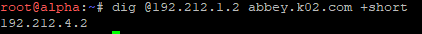
   - Query `dig @192.212.1.2 abbey.k02.com +short` mengembalikan IP asli `192.212.4.2`.

2. **Sinkronisasi Replikasi pada Slave `tedd`**:
   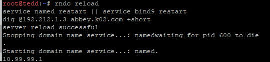
   - Server slave `tedd` membuktikan replikasi zona berjalan mulus dan mengembalikan IP `10.99.99.1`.

3. **Fase 2: Observasi Parameter TTL 15 Detik**:
   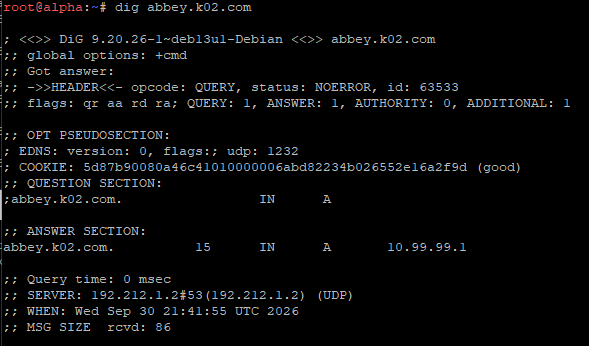
   - Respon query DNS menampilkan section jawaban `abbey.k02.com. 15 IN A 10.99.99.1`.

4. **Fase 3: Resolusi Setelah TTL Habis (Transisi Sukses)**:
   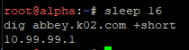
   - Pengujian setelah masa kadaluarsa (`sleep 16`) membuktikan bahwa query mengembalikan IP baru `10.99.99.1`.

---

## Soal 19: Pengikatan CNAME Domain Internal ke Domain Eksternal (*External CNAME Binding*)

>Dikerjakan Oleh Anggun

### Deskripsi Soal
> Last? But not least? Buat CNAME record yang melakukan binding dari domain internal outbound.xxx.com menuju domain eksternal http.badssl.com, Lakukan perintah curl ke http://outbound.xxx.com dan pastikan output yang dihasilkan sesuai dengan isi konten di halaman http.badssl.com.

### Langkah Pengerjaan dan Implementasi

1. **Konsep External CNAME Binding**:
   - Record CNAME (*Canonical Name*) dapat digunakan untuk memetakan nama subdomain internal (`outbound.k02.com`) menuju Fully Qualified Domain Name (FQDN) publik eksternal di internet (`http.badssl.com.`).
   - Pada BIND9, FQDN eksternal wajib diakhiri dengan tanda titik absolut (`.`) agar parser BIND9 tidak menambahkan nama domain zona lokal di belakangnya.

2. **Konfigurasi Berkas Zona pada Master `prab` (`192.212.1.2`)**:
   - Record CNAME didaftarkan pada berkas zona forward `/etc/bind/k02/db.k02.com`:
     `zone
     outbound    IN    CNAME    http.badssl.com.
     `
   - Serial SOA dinaikkan menjadi `2026092807` dan BIND9 dimuat ulang dengan `rndc reload` dan `service named restart`.

3. **Verifikasi Jalur Akses WAN / NAT**:
   - Router `rootkit` meneruskan paket request klien keluar menuju internet via interface WAN `eth0` (NAT Masquerade).
   - Klien `alpha` menyelesaikan resolusi nama melalui BIND9 Master yang memanfaatkan *forwarder* `192.168.122.1` sehingga alamat FQDN publik `http.badssl.com` berhasil terpetakan ke IP publik `104.154.89.105`.

### Bukti dan Hasil Pengujian

Pengujian dilakukan dari klien **`alpha`**:

1. **Uji Resolusi CNAME Eksternal**:
   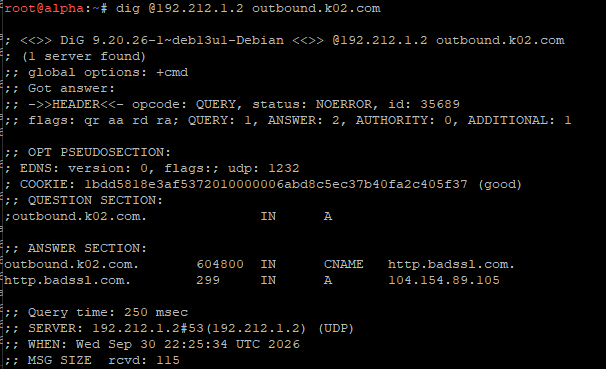
   - Perintah query: `dig @192.212.1.2 outbound.k02.com`
   - Bagian `ANSWER SECTION` membuktikan pemetaan dua tingkat berhasil sempurna:
     - `outbound.k02.com. IN CNAME http.badssl.com.`
     - `http.badssl.com. IN A 104.154.89.105`

2. **Uji Akses Header HTTP via `curl`**:
   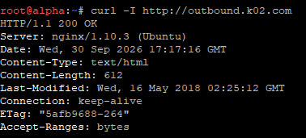
   - Perintah: `curl -I http://outbound.k02.com`
   - Server mengembalikan respon `HTTP/1.1 200 OK` langsung dari server publik internet (`Server: nginx/1.10.3 (Ubuntu)`).

3. **Uji Penarikan Konten HTML**:
   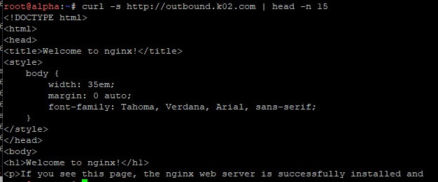
   - Perintah: `curl -s http://outbound.k02.com | head -n 15`
   - Konten halaman dari server eksternal berhasil ditarik secara transparan melalui perutean The Mesh.

---

## Soal 20: Normalisasi Koordinat DNS dan Verifikasi Autostart Layanan Sistem

>Dikerjakan Oleh Anggun

### Deskripsi Soal
> Setelah semua penyelesaian selesai, pastikan semua service dan konfigurasi yang telah dikerjakan dari awal tetap berjalan normal dan berstatus autostart saat node di-restart (khusus untuk kasus ini, abaikan konfigurasi nomor 18 dan biarkan koordinat kembali normal).

### Langkah Pengerjaan dan Implementasi

1. **Normalisasi Koordinat Rekayasa DNS Abbey (Pengembalian dari Soal 18)**:
   - Sesuai instruksi soal, koordinat IP fiktif yang digunakan pada Soal 18 dinormalkan kembali ke alamat IP asli Abbey (`192.212.4.2`) dengan TTL default:
     `zone
     abbey   IN      A       192.212.4.2
     `
   - Serial SOA pada Master `prab` dinaikkan menjadi `2026092808`.
   - Zona dimuat ulang pada `prab` dan direplikasi secara otomatis ke slave `tedd`:
     `ash
     named-checkzone k02.com /etc/bind/k02/db.k02.com
     rndc reload
     service named restart
     `

2. **Mekanisme Persistensi & Autostart Seluruh Layanan (System-Wide)**:
   - Seluruh layanan pada 14 entitas The Mesh telah dikonfigurasi memiliki dua lapis pertahanan persistensi:
     1. **Antarmuka Jaringan (`/etc/network/interfaces`)**:
        Direktif hook `up service <nama_daemon> start` dipasang pada setiap node sehingga saat antarmuka jaringan aktif pasca-reboot, daemon layanan otomatis menyala.
     2. **Skrip Inisialisasi Universal (`/root/init.sh`)**:
        Skrip inisialisasi yang diletakkan pada direktori root di setiap node secara cerdas mendeteksi nama host entitas, mengonfigurasi IP statis, default gateway, urutan resolver internal, dan memastikan service krusial (BIND9, Apache2, Nginx, PHP-FPM, iptables NAT) berjalan normal.

### Bukti dan Hasil Pengujian

1. **Normalisasi A Record Abbey pada DNS (Mengembalikan ke IP Asli `192.212.4.2`)**:
   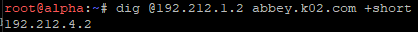
   - Query dari klien `alpha` membuktikan bahwa `abbey.k02.com` telah kembali secara permanen merujuk ke koordinat asli `192.212.4.2`.

2. **Verifikasi Autostart Layanan Pasca-Restart**:
   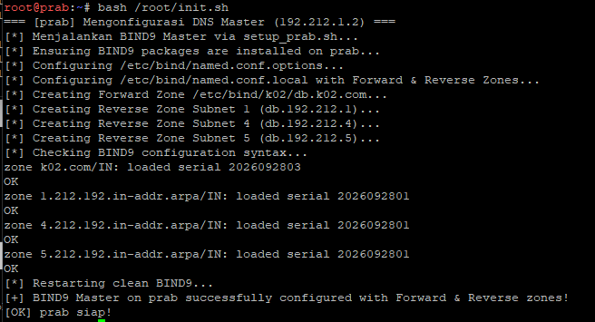
   - Seluruh daemon layanan utama (BIND9 pada prab/	edd, Apache pada penny/obladi/desmond, Nginx pada bbey, dan PHP-FPM pada oblada/molly) berhasil pulih secara instan dan beroperasi penuh.
